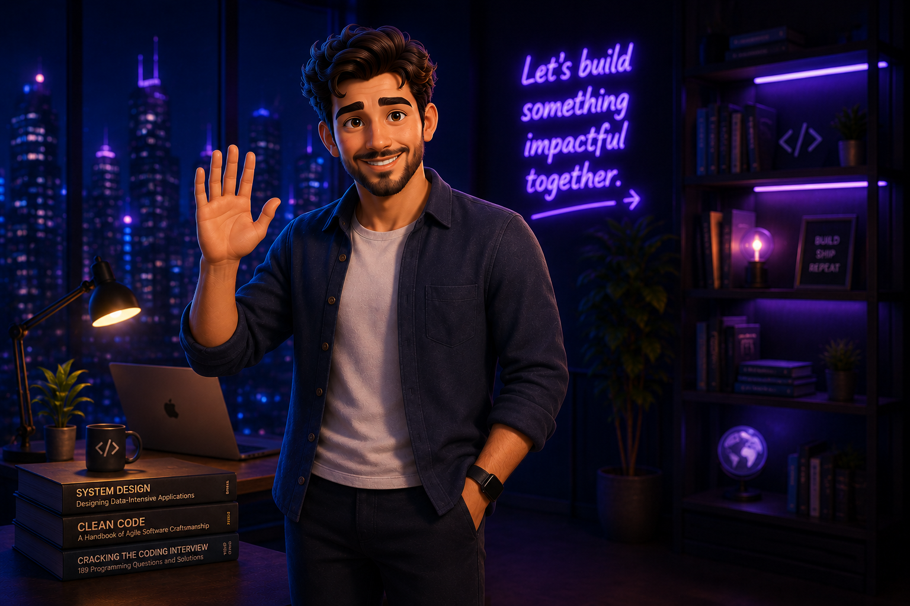

<h1 align="center">
  Hi  I'm Dimitar Barev
</h1>

<h3 align="center">
  
</h3>

  
  

## About Me

- 🔬 Scientific Assistant Intern at **Fraunhofer IAO**, researching OCR benchmarking and AI-powered document processing
- 🎓 Software Engineering student at **Fontys University of Applied Sciences**
- ⚙️ Former Software Engineering Intern at **ASML**
- ☁️ Experience with **Java, Spring Boot, Python, Docker, RabbitMQ, Auth0, CI/CD, Kubernetes, AWS, and Azure**
- 🏗️ Interested in **Software Architecture, Distributed Systems, AI Systems, OCR, and Applied Research**
- 🎤 Active Toastmasters speaker and public speaking enthusiast
- 🏊 Endurance athlete passionate about running, swimming, cycling, and triathlon

## Professional Journey

<table align="center">
  <tr>
    <td align="center"><strong>2024</strong></td>
    <td>⚙️ <strong>ASML</strong></td>
    <td>Software Engineering Intern</td>
  </tr>
  <tr>
    <td align="center"><strong>2025</strong></td>
    <td>🤖 <strong>CCEP Australia</strong></td>
    <td>AI Adoption Specialist</td>
  </tr>
  <tr>
    <td align="center"><strong>2026</strong></td>
    <td>🔬 <strong>Fraunhofer IAO</strong></td>
    <td>Scientific Assistant</td>
  </tr>
  <tr>
    <td align="center"><strong>2026</strong></td>
    <td>🎓 <strong>Fontys University</strong></td>
    <td>Graduating Software Engineering</td>
  </tr>
</table>

## Featured Projects

| Project | Description | Tech Stack |
|----------|-------------|------------|
| 🧠 OCR Benchmarking Platform | Evaluation and benchmarking platform for OCR models on insurance invoices | Python, OCR, AI, Evaluation Metrics |
| 🏗️ Dimotion | Collaboration platform built using a microservices architecture | Spring Boot, React, RabbitMQ, Docker |
| ⚡ ASML Prioritization Library | Java library for priority-based scheduling and request processing | Java, JUnit, Gradle |
| 🌐 Federated Learning Platform | Distributed AI monitoring and experimentation platform | Python, Azure, Kubernetes |

## Languages & Tools

  

## Currently Exploring

- 🤖 Agentic AI Systems
- 📄 OCR and Intelligent Document Processing
- ☁️ Cloud Native Architectures
- 📊 AI Evaluation Frameworks
- 🏗️ Software Architecture & Distributed Systems

## Connect With Me

  <a href="https://portfolio-theta-dun-ejq1lqeyg0.vercel.app/">Portfolio</a> •
  <a href="https://www.linkedin.com/in/dimitarbarev">LinkedIn</a>

